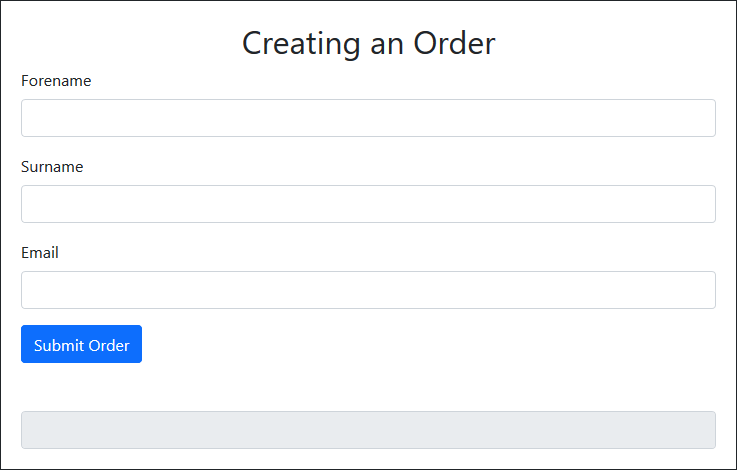
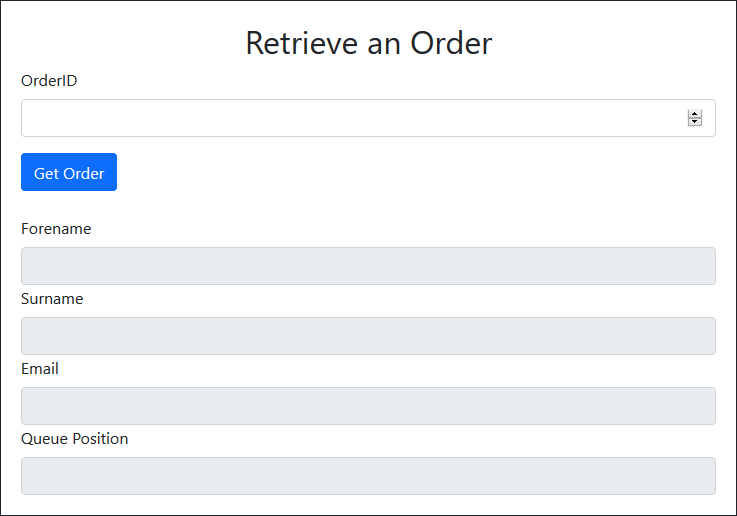
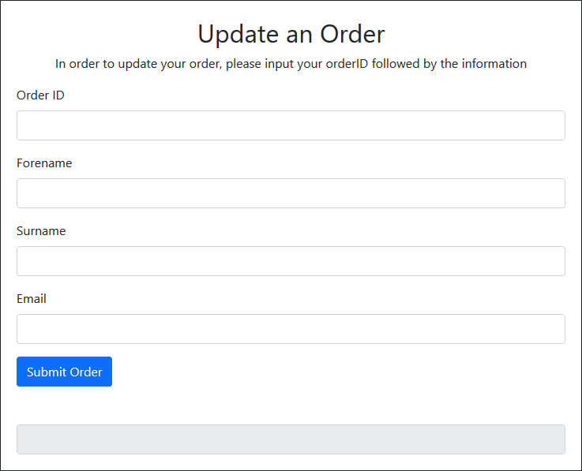
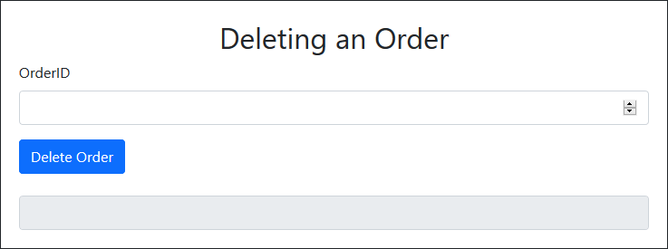

#SFIAProject

  

<!--- Code for Shields.io buttons --->

   
   

  

  <ul>
    <li><a href="#Introduction">Introduction</a></li>
    <li><a href="#Application">Application</a></li>
    <li>Usage</li>
    <li>Credits</li>
  </ul>

 
 

<h2 id="Introduction">Introduction</h2>
 

This is a short introduction into my project for QA's Cloud Native Development course.

In this .README I will be going through the product I have built and the general fundamentals of the application

To start us off, I'd like to just give you some of the ideas that I originally had when scoping this project. Below are some of these ideas.

#### Ideas:
* Runescape Slayer helper
  * _Inbuilt calculator (Current task experience) -- Calculates experience you will receive from current task by MonsterHP x Quantity_
  * _Searchable database, shows slayable monsters at X level_
  * _provides recommendable gear for task + provides notable drops_

* Fantasy Football
  * _Searchable Player database for player stats (goals, appearance, assists etc)_
  * _Searchable Team database for team stats (Games played, wins,losses, conceded etc)_
  * _Team compare/Player compare. (Compares the above stats)_
  * _Team creator / Budget_
  * _Player prices_
  * _Generic fantasy football app_

* Queuing Simulator
  * _Ability to add yourself to a queue for a product_
  * _Ability to remove yourself from a queue with the orderID_
  * _The Ability to read the details originally entered for the order_
  * _The Ability to also update any details of the order._
  
  
  

<h2 id="Application">Application</h2>
 

The application that I decided to go for as my project idea is the **Queuing Simulator** In this short document I will describe the basic function of the application and will detail how to use the application in the <a href="#Usage">Usage</a> portion of this .README

The **Queuing Simulator** is a basic application which will allow the users to CREATE, REMOVE, UPDATE and DELETE an order from the database. 
 
 

### **The Application**
 

<h4 id="CREATE"><b>CREATE:</b></h4>

This is the basic application interface for the **CREATE** functionality:

<h4 id="READ"><b>READ:</b></h4>

This is the basic application interface for the **READ** functionality:

<h4 id="UPDATE"><b>UPDATE:</b></h4>

This is the basic application interface for the **UPDATE** functionality:

<h4 id="DELETE"><b>DELETE:</b></h4>

This is the basic application interface for the **DELETE** functionality:

 
 

<h2 id="Usage">Usage</h2>

In this section I will detail how to use each of the applications functions.
 
 

#### **CREATE:**
In order for the user to create an order, they must first fill out the form located under the <a href="#CREATE">CREATE</a> subheading inside <a href="#Application">application</a>

#### **READ:**
Once an order is created, the user will be given an **orderid** this ID will allow the user to do all of the other functionalities. One being **READ**, again the user must fill out the form under <a href="#READ">READ</a> and the correct information relating to that order id will be pulled from the database and displayed

#### **UPDATE:**
Further to the **READ** function, the user can also choose to update their details. By again navigating the to the <a href="#UPDATE">UPDATE</a> form and filling in the neccessary information.

#### **DELETE:**
Lastly the users have the option to <a href="#DELETE">DELETE</a> their information from the database. To do this they will need their **orderid** and simply fill in the orderID and press delete.

